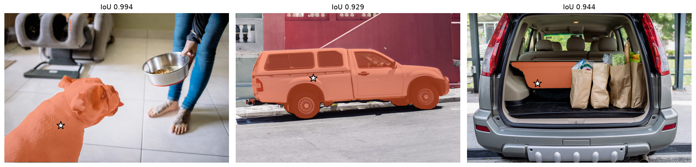
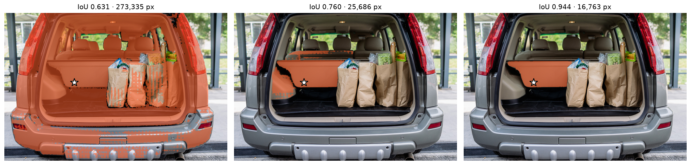

# Segment Anything — Implemented from the Paper

A from-scratch PyTorch implementation of Meta AI's Segment Anything Model
(SAM), written directly from the publication. Correctness is verified by
loading Meta's official ViT-B checkpoint with **zero parameter mismatches** —
every tensor maps onto the implementation under `strict=True`.

[](https://colab.research.google.com/github/Kshitiz-2002/sam-from-scratch/blob/main/demo.ipynb)


<p align="center">
  
  <br>
  <em>Single-point prompts on unseen images. The star marks the click; the overlay is the model's highest-confidence mask.</em>
</p>

---

## Overview

Segment Anything is a promptable segmentation model: given a point, box, or
coarse mask, it returns a pixel-accurate mask for the indicated object. This
repository reimplements the full architecture — image encoder, prompt encoder,
and mask decoder — from Kirillov et al. (2023) and Dosovitskiy et al. (2021),
without adapting the reference implementation.

**Why implement from the paper rather than use the released code?** Reading an
architecture and building it are different skills. Working from the publication
forces engagement with the design decisions: why relative position embeddings
are decomposed into separate axes, why attention is windowed in most layers but
global in four, why the decoder updates both the prompt tokens and the image
features rather than treating one as fixed.

Checkpoint compatibility is the objective check on that work. An implementation
that accepts the official weights under `strict=True` is correct at the level of
every individual tensor, not merely shape-compatible.

---

## Results

| Verification | Outcome |
|---|---|
| `load_state_dict(strict=True)` with `sam_vit_b_01ec64.pth` | Passes — 0 missing, 0 unexpected |
| Parameter count | 89.7 M (matches published ViT-B configuration) |
| Window partition round-trip | Exact reconstruction |
| Bidirectional update in two-way transformer | Verified — both streams change per block |
| Gradient flow to image and prompt inputs | Verified |
| Point prompt, natural image | Predicted IoU 0.994 |
| Box prompt, natural image | Predicted IoU 0.952 |

Latency on an NVIDIA T4, 1024×1024 input:

| Stage | Time | Frequency |
|---|---|---|
| Image encoder | ~1,200 ms | Once per image |
| Prompt encoder + mask decoder | ~25 ms | Once per prompt |

The ~50× ratio is the architectural point: encoding is amortised across an
interactive session, so each additional click is effectively free. The included
web application exploits this with separate `/embed` and `/segment` endpoints.

---

## Quick start

**Colab (no local setup, free GPU)** — click the badge above.

**Local installation:**

```bash
git clone https://github.com/Kshitiz-2002/sam-from-scratch
cd sam-from-scratch
pip install -r requirements.txt
wget https://dl.fbaipublicfiles.com/segment_anything/sam_vit_b_01ec64.pth
```

```python
import torch
from model.image_encoder import ImageEncoderViT
from model.prompt_encoder import PromptEncoder
from model.transformer import TwoWayTransformer
from model.mask_decoder import MaskDecoder
from model.sam import SAM

sam = SAM(
    image_encoder=ImageEncoderViT(
        embed_dim=768, depth=12, num_heads=12,
        use_rel_pos=True, window_size=14,
        global_attn_indexes=(2, 5, 8, 11),
    ),
    prompt_encoder=PromptEncoder(
        embed_dim=256, image_embedding_size=(64, 64),
        input_image_size=(1024, 1024), mask_in_chans=16,
    ),
    mask_decoder=MaskDecoder(
        transformer_dim=256,
        transformer=TwoWayTransformer(
            depth=2, embedding_dim=256, num_heads=8, mlp_dim=2048
        ),
    ),
)
sam.load_state_dict(torch.load("sam_vit_b_01ec64.pth"))
sam.eval().cuda()
```

**Interactive web demo:**

```bash
python app.py     # http://localhost:5000
```

---

## Architecture

```
Input image (1024 × 1024 × 3)
        │
        ▼
┌───────────────────────────────┐
│  ImageEncoderViT              │   ViT-B/16 · 89.7 M parameters
│  patch embed → +abs pos       │   Runs once per image
│  → 12 transformer blocks      │   8 windowed (14×14), 4 global
│  → neck (1×1, 3×3 conv)       │
└───────────────┬───────────────┘
                │ image embedding (256, 64, 64)
                │
Prompts ────────┤
(point/box/mask)│
        ▼       ▼
┌───────────────────────────────┐
│  PromptEncoder                │   Runs once per prompt set
│  sparse → (N, 256) tokens     │
│  dense  → (256, 64, 64) map   │
└───────────────┬───────────────┘
                ▼
┌───────────────────────────────┐
│  MaskDecoder                  │   ~25 ms per prompt
│  two-way transformer (×2)     │
│  → 4× upscale                 │
│  → per-mask hypernetwork MLPs │
└───────────────┬───────────────┘
                ▼
      3 masks + IoU confidence scores
```

The encoder/decoder split is deliberate: a heavyweight backbone computes a
reusable image representation once, and lightweight modules query it
repeatedly. This asymmetry is what makes the model usable interactively.

### Image encoder

A Vision Transformer adapted for high-resolution dense prediction. Two
departures from standard ViT:

**Windowed attention.** Global self-attention over a 64×64 patch grid requires a
4096×4096 score matrix per head. Eight of twelve blocks instead attend within
non-overlapping 14×14 windows; blocks 2, 5, 8, and 11 retain global attention.
Because 64 is not divisible by 14, the grid is zero-padded to 70×70, partitioned
into 25 windows, and cropped after attention. The partition and its inverse
reconstruct the input exactly.

**Decomposed relative position embeddings.** Rather than learning a bias for
every ordered pair of positions — quadratic in sequence length — the encoder
learns one embedding per *relative offset*, factored across axes:

```
bias(q, k) = rel_h[q_row − k_row] + rel_w[q_col − k_col]
```

For an axis of length L there are 2L−1 possible offsets, giving a
`(2L−1, head_dim)` table per axis. Two one-dimensional lookups replace one large
two-dimensional table, and the resulting bias is translation-equivariant: the
relationship "one patch to the left" is represented identically regardless of
absolute position — a stronger inductive bias for vision than absolute
encodings alone.

### Prompt encoder

Sparse prompts (points, boxes) are mapped to 256-dimensional tokens: a random
Fourier positional encoding of the coordinate summed with a learned type
embedding. Five type embeddings exist — foreground point, background point, box
top-left corner, box bottom-right corner, and a padding token used when batching
prompt sets of differing length.

Dense prompts (mask inputs) pass through strided convolutions until they reach
`(256, 64, 64)`, matching the image embedding spatially and in channel count,
and are summed onto it element-wise. When no mask is supplied, a learned
"no mask" embedding is broadcast across the grid.

### Mask decoder

The architecturally novel component. A **two-way transformer** in which prompt
tokens and image features update each other, four operations per block:

1. Self-attention among prompt tokens
2. Cross-attention: tokens attend to the image
3. Position-wise MLP on the tokens
4. Cross-attention: **the image attends back to the tokens**

Step 4 distinguishes this from a conventional decoder — the image representation
is refined by the prompt rather than held fixed. Positional encodings are
re-injected before each attention operation rather than added once at the input,
preserving geometric information through the residual stream.

The decoder maintains five learned tokens beyond the prompt: four mask tokens
and one IoU token. After the transformer, each mask token is mapped by a
dedicated MLP to a 32-dimensional vector serving as **the weights of a linear
classifier generated at inference time**. Its inner product with every location
of the 4×-upscaled image embedding yields a mask. Because the classifier is
synthesised per prompt, the model segments arbitrary objects without a fixed
category vocabulary.

**Handling ambiguity.** A single click underdetermines the target — clicking a
person's shirt could indicate the shirt, the person, or a pocket. Rather than
regressing toward an average of valid interpretations, the decoder emits three
nested candidates, and the IoU token is decoded into a predicted quality score
for each so they can be ranked. A fourth token handles the unambiguous
multi-prompt case.

<p align="center">
  
  <br>
  <em>One click, three valid interpretations: the vehicle, the cargo shelf and panel, and the shelf alone. The model returns all three and ranks them.</em>
</p>

---

## Repository structure

```
model/
├── common.py            MLPBlock, LayerNorm2d (channels-first)
├── image_encoder.py     PatchEmbed, Attention with relative position
│                        embeddings, window partitioning, Block,
│                        ImageEncoderViT
├── prompt_encoder.py    PositionEmbeddingRandom, PromptEncoder
├── transformer.py       Cross-attention, TwoWayAttentionBlock,
│                        TwoWayTransformer
├── mask_decoder.py      MLP, MaskDecoder
└── sam.py               SAM — preprocessing, orchestration, postprocessing

app.py                   Flask application with /embed and /segment endpoints
demo.ipynb               Annotated Colab notebook
experiment.ipynb         Development log — modules built and validated in sequence
Dockerfile               Container definition for deployment
```

Every module carries explicit tensor-shape annotations at each transformation.
`experiment.ipynb` is retained deliberately: it records the incremental
construction and shape verification of each component.

---

## Implementation notes

**Memory.** ViT-B inference requires approximately 4 GB in fp32 and 2 GB in
fp16. ViT-L and ViT-H are supported by adjusting `embed_dim`, `depth`,
`num_heads`, and `global_attn_indexes`, then loading the corresponding
checkpoint.

**Scope.** Training code is not included. The original model was trained on 256
A100 GPUs for 68 hours across 11 million images; this repository concerns the
architecture. Fine-tuning the mask decoder against cached image embeddings is
the tractable adaptation path and fits within 8 GB of VRAM.

**Deployment.** The included Dockerfile builds a CPU inference container. The
`/embed` and `/segment` endpoint split mirrors the encoder/decoder asymmetry,
caching image embeddings so interactive prompting does not re-run the backbone.

---

## References

1. A. Kirillov et al. *Segment Anything.* ICCV 2023. [arXiv:2304.02643](https://arxiv.org/abs/2304.02643)
2. A. Dosovitskiy et al. *An Image is Worth 16×16 Words: Transformers for Image Recognition at Scale.* ICLR 2021. [arXiv:2010.11929](https://arxiv.org/abs/2010.11929)
3. A. Vaswani et al. *Attention Is All You Need.* NeurIPS 2017. [arXiv:1706.03762](https://arxiv.org/abs/1706.03762)
4. [facebookresearch/segment-anything](https://github.com/facebookresearch/segment-anything) — official checkpoints

---

## License

Apache 2.0, consistent with the original SAM release. Pretrained checkpoints
remain the property of Meta AI and are subject to their terms.